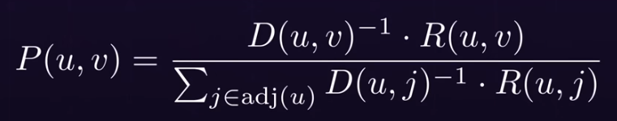
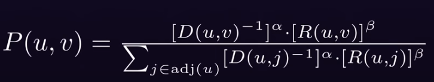

# TSP accross the Czech republic - a parallel Ant Colony implementation

Navigating through approximately 6300 cities and settlements in the Czech Republic efficiently poses a significant challenge. The Traveling Salesman Problem (TSP) requires finding the shortest route that starts in any city, visits each city exactly once and returns to the starting city. This document outlines an approch on how to tackle problem instances of such massive size - which naturally leads to parallelism and more sophisticated algorhitms.

Ant colony optimization is a probabilistic multi agent technique which mimics the behaviour and interaction of of real ants for solving computational problems which can be reduced to finding good paths through graphs. 

*All cities, villages and or settlements will be refered to as cities from now on*

# Obtain the geographic data of all the cities in a workable format
After a little bit of looking i was able to find this git [repo](https://github.com/cesko-digital/obce) 
which has the data in a JSON with the following format:
```{
      "hezkyNazev": "Borohrádek",
      "eDeskyID": "549",
      "souradnice": [
        50.09505054163067,
        16.089249722106842
      ],
      "zkratka": "BOROHRADEK",
      "ICO": "00274739",
      "nazev": "MĚSTO BOROHRÁDEK",
      "datovaSchrankaID": "jyybfef",
      "pravniForma": {
        "type": 801,
        "label": "Obec"
      },
      "mail": [
        "podatelna@mestoborohradek.cz"
      ],
      "adresaUradu": {
        "ulice": "Husova",
        "cisloDomovni": "240",
        "cisloOrientacni": null,
        "obec": "Borohrádek",
        "obecKod": "576131",
        "PSC": "51724",
        "castObce": "Borohrádek",
        "kraj": "Královéhradecký",
        "adresniBod": "21511888"
      }
}
```
The only data we need are the coordinates and the city names, so let's use Python to parse and save them in a format that will be comfortable to use in c++:
```
def parse_json_to_output_file(json_file, output_file):
    with open(json_file, 'r', encoding='utf-8') as f:
        json_data = json.load(f)
        with open(output_file, 'w', encoding='utf-8') as out_f:
            for municipality in json_data['municipalities']:
                coordinates = municipality['souradnice']
                if (coordinates):
                    full_name = municipality['hezkyNazev']
                    out_f.write(f'"{full_name}" {coordinates[0]} {coordinates[1]}\n')
```
output:
```
"Borohrádek" 50.09505054163067 16.089249722106842
"Broumov" 50.587779713631235 16.33021464390211
"Hronov" 50.480483070917344 16.181297806214516
"Jablonec nad Jizerou" 50.70325416139627 15.429846275850794
"Lomnice nad Popelkou" 50.531591305801584 15.372805868216096
"Náchod" 50.41632599883447 16.163860372594378
"Pec pod Sněžkou" 50.69347490654679 15.733319249047264
"Solnice" 50.20463218347285 16.238229404531502
"Svoboda nad Úpou" 50.626021429145105 15.816103646356355
"Teplice nad Metují" 50.59481240233556 16.169602605679103
...
```
## Load the data in c++ and construct a distance matrix
While the data loading is nothing interesting, what is note worthy is that we will be using the [Haversine Formula](https://en.wikipedia.org/wiki/Haversine_formula) to calculate distances between gps cordinates, implemented as such:
```
static double haversine(double lat1, double lon1, double lat2, double lon2){
        double dLat = (lat2 - lat1) * M_PI / 180.0;
        double dLon = (lon2 - lon1) * M_PI / 180.0;
        lat1 = (lat1) * M_PI / 180.0;
        lat2 = (lat2) * M_PI / 180.0;
        double a = pow(sin(dLat / 2), 2) + pow(sin(dLon / 2), 2) * cos(lat1) * cos(lat2);
        double rad = 6371;
        double c = 2 * asin(sqrt(a));
        return rad * c;
    }
```
*Please note that the formula assumes the Earth is a perfect sphere, which results in some inaccuracy, but the difference on the scale of a small country with less than 400 km distances is negligable*

# The implementation
In the implementation, we deploy multiple ants onto random nodes of the graph. Each ant visits all the cities without revisiting any, constructing a cycle. Each cycle is evaluated by its length, where the shorter it is, the better. As ants traverse the graph, they leave behind pheromone trails on the edges they traverse. The quantity of pheromones deposited on an edge is inversely proportional to the length of the path, incentivizing subsequent ants to favor shorter routes.

When an ant, starting from a random city, needs to choose its next destination, it employs a probabilistic decision-making process based on the following formula:



In words, the probability to take the edge(u,v) from the current city u to the **unvisited** city v is equal to the inverse distance of u and v, multipled by the pheromone load on the edge from u to v. This probability is then normalized by dividing it by the sum of similar calculations performed for all unvisited neighboring nodes.

To control the influence of the inverse distance and the pheromone level, two parameters, Alpha and Beta, are introduced. Adjusting these parameters allows fine-tuning the algorithms behavior. For example setting Beta to 0 would make the pheromone level inconsequential and the algorithm would resemble the behavior of a Nearest Neighbor Search


After the completion of each iteration of ant traversals, the pheromone levels on every edge of the graph are multipled by an evaporation constant, Gamma. This parameter represents a degradation constant, a parameter between 0 and 1, which symbolizes the passage of time. This replicates the natural degradation of pheromones over time, preventing the influence of poor past solutions from excessively affecting recent, potentially better ones.

As mentioned before, the ants leave a pheromone trail relative to the inverse of the total cycle lenght, we hovever dont know the total cycle lenght until the ants finish the iteration, so we also do it after, indroducing a forth parameter, Delta, which allows control over how many pheromones relative to the total lenght of the path are deposited, typically calculated as Delta/cycle len.
# The code
## Core loop
```
void antColonyOptimazation(){
        for (int iteration = 0; iteration < ITERATIONS; iteration++){
            std::vector<AntResult> results(NUM_OF_ANTS);
            for (auto & ant: results){
                singleAntTraversal(ant);
            }
            std::sort(results.begin(), results.end());
            if (results[0].totalPathDistance < currBestDistance){
                currBestDistance = results[0].totalPathDistance;
                currBestPath = results[0].path;
            }
            for (int i = 0; i < cityCnt; i++){
                for (int j = 0; j < cityCnt; j++){
                    pheromoneMatrix[i][j] *= EVAPORATION_CONSTANT;
                }
            }
            // keep only top half of the solutions to speed up the execution
            for (int i = 0; i < NUM_OF_ANTS/2; i++){
                double change = DELTA / results[i].totalPathDistance;
                auto & pathRef = results[i].path;
                for (int j = 0; j < cityCnt - 1; j++){
                    pheromoneMatrix[pathRef[j]][pathRef[j+1]] += change;
                }
                pheromoneMatrix[pathRef[cityCnt - 1]][pathRef[0]] += change;
            }
        }
}
```
## Single ant traversal
```
void singleAntTraversal(AntResult & ant){
        int currCityInOrder = 0;
        int currentIndex = rand() % cityCnt;
        std::vector<bool> visited(cityCnt, false);
        visited[currentIndex] = true;
        ant.path[0] = currentIndex;
        while (++currCityInOrder < cityCnt){
            currentIndex = selectNextCity(visited, currentIndex);
            visited[currentIndex] = true;
            ant.path[currCityInOrder] = currentIndex;
        }
        ant.totalPathDistance = getTotalPathDistance(ant.path);
}
```
## Select next city
```
int selectNextCity(std::vector<bool> & visited, int current){
        for (int node = 0; node < cityCnt; ++node) {
            if (visited[node] || node == current) continue;
            double pheromoneLevel = pheromoneMatrix[current][node]; 
            double value = pow(pheromoneLevel, ALPHA) / pow(distanceMatrix[current][node], BETA);
            neighborIndexes.push_back(node);
            neighborValues.push_back(value);
        }
        std::discrete_distribution<> distribution(neighborValues.begin(), neighborValues.end());
        int next = neighborIndexes[distribution(rd)];
        return next;
}
```
# Performance
Lets now run the single threaded version on all 6367 cities using a resonable number of 10 iterations of 16 ants each:
```
 currNewBest = 29870.7 km.
Iteration took: 34 s
 currNewBest = 27393.4 km.
Iteration took: 34 s
 currNewBest = 26942.1 km.
Iteration took: 35 s
 currNewBest = 26656.8 km.
Iteration took: 34 s
 currNewBest = 26269.6 km.
Iteration took: 34 s
 currNewBest = 26038.5 km.
Iteration took: 34 s
Iteration took: 35 s
Iteration took: 34 s
Iteration took: 34 s
 currNewBest = 25918.6 km.
Iteration took: 34 s
Execution took: 346 s
```
Ouch..
# Lets use threads !
The nature of the problem allows for super simple parallization by launching each ant traversal, which takes the vast majority of execution time of each iteration, in a seperate thread. Remember that each ant operates completly seperatly, accessing, but not modifing the shared distanceMatrix and pheromoneMatrix, while storing its data in its local scope. After all the ants have competed the traversal, we can join their threads and update the pheromoneMatrix with a single thread and continue to the next iteration. For ease of comparison lets set the thread count to the NUM_OF_ANTS constant and let the operating system handle it 
```
for (int iteration = 0; iteration < ITERATIONS; iteration++){
            std::vector<AntResult> results(NUM_OF_ANTS);
            std::vector<std::thread> threads(NUM_OF_ANTS);
            for (int i = 0; i < NUM_OF_ANTS; i++){
                threads[i] = std::thread(&Map::singleAntTraversal, this, std::ref(results[i])); 
            }
            for (auto & thr: threads) thr.join();
            ...
```
Same map with 10 iterations of 16 ants each on a 8 core, 16 thread Ryzen 7 7800X3D:
```
 currNewBest = 29815.83302 km.
Iteration took: 1 s
 currNewBest = 27375.05935 km.
Iteration took: 1 s
 currNewBest = 26938.4521 km.
Iteration took: 1 s
 currNewBest = 26628.76681 km.
Iteration took: 1 s
 currNewBest = 26453.60613 km.
Iteration took: 1 s
 currNewBest = 26277.09867 km.
Iteration took: 1 s
Iteration took: 1 s
 currNewBest = 25996.08948 km.
Iteration took: 1 s
Iteration took: 1 s
Iteration took: 1 s
Execution took: 13 s
```
### sources
https://strikingloo.github.io/ant-colony-optimization-tsp

https://www.youtube.com/watch?v=GiDsjIBOVoA 